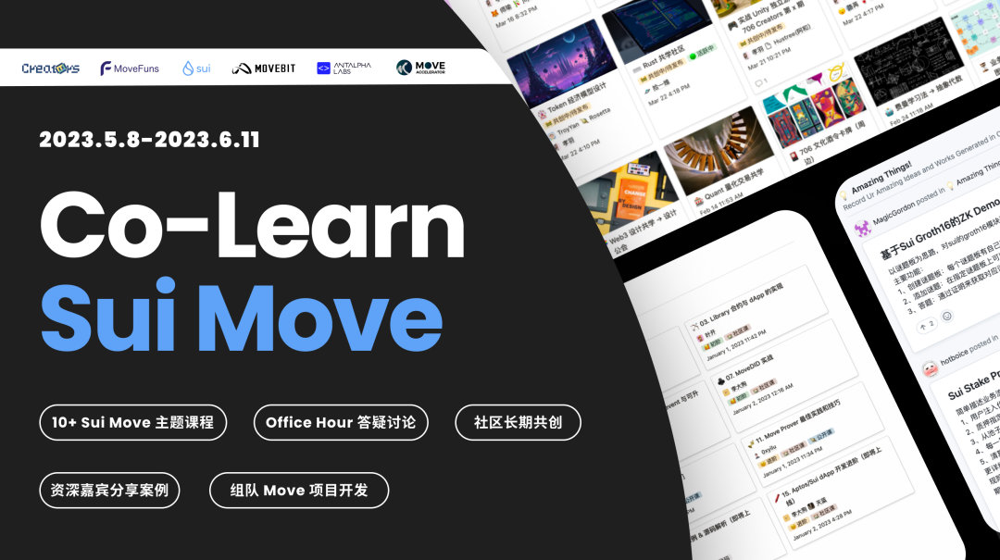

# Move-Co-Learn

## Intro of move co learn

 🚀

**Move 共学社区第三期
在 Sui 主网上线之际，捕获 Web3 新机遇**

作为专门为区块链开发的一种安全可靠的智能合约编程语言， Move 已经在小范围内流行开来，而 Sui 在 Move 上做了很多创新，比如 Object 模型、创新性共识，创新性存储......随着 **Sui 主网上线**，Sui Move 有望在未来把 Move 生态带上一个新浪潮。

因此，本期共学主题聚焦 Sui Move，在五月 Sui 主网上线之际，我们想让更多开发者可以**轻松入门**，通过系统学习和实战开发，了解 Move 的魅力与潜力。

经过两期的 Move 共学，我们已经沉淀了大量的技术问答和讨论，也有越来越多的 Move 开发者顺利毕业，成为了帮助其他成员的 Maintainer，与此同时，共学还诞生了 10 余个共创项目，我们仍持续帮助开发者们不断完善，协助他们**申请和获得 Grant**。

## 课程计划

- [unit-1](./courses/unit-1)
  - [1.1 Sui Move 入门](./courses/unit-1/1-get-start/README.md)
  - [1.2 Sui Move 语法](./courses/unit-1/2-syntax-of-sui-move/README.md)
  - [1.3 合约测试](./courses/unit-1/3-move-test/README.md)
- [unit-2](./courses/unit-2)
  - [2.1 Object 讲解](./courses/unit-2/1-object/README.md)
  - [2.2 设计模式](./courses/unit-2/2-patterns/README.md)
- [unit-3](./courses/unit-3)
  - [3.1 Sui NFT/FT 讲解](./courses/unit-3/1-NFT-FT/README.md)
  - [3.2 数据类型](./courses/unit-3/2-data-structure/README.md)
  - [3.3 Framework 介绍](./courses/unit-3/3-Framework/README.md)
- [unit-4](./courses/unit-4)
  - [4.1 前端 SDK 调用 - TS SDK](./courses/unit-4/1-ts-sdk/README.md)
  - [4.2 Events & 可升级合约](./courses/unit-4/2-event-with-contract-upgrade/README.md)
  - [4.3 Sui 经济模型](./courses/unit-4/3-sui-tokenomics/README.md)

