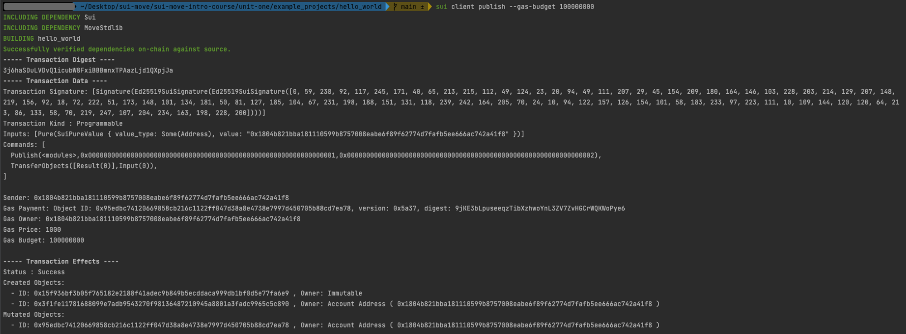
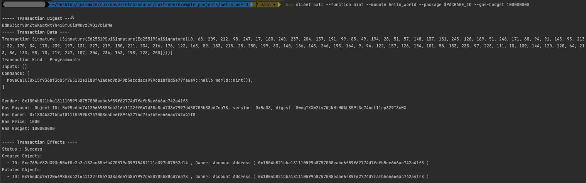
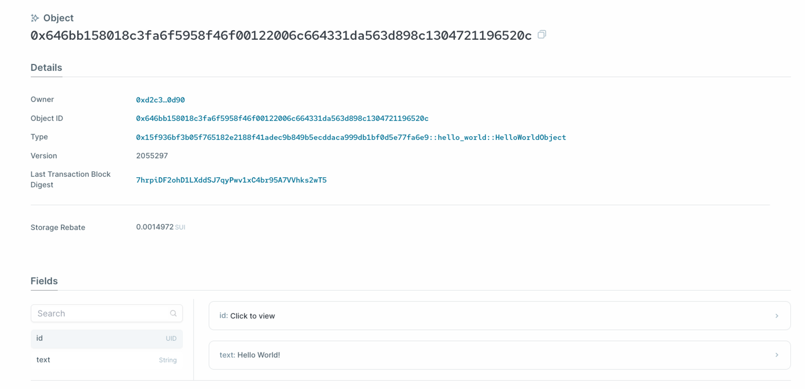

# 0x01 Sui 项目结构

## Sui Module 与 Package

- 一个 Sui module 是一系列函数 functions 和类型 types 打包后的集合，被开发者发布到一个特定的地址下

- Sui 的标准库发布在 `0x2` 地址下，而用户发布 modules 的地址则是 Sui Move 虚拟机分配的伪随机地址

- Module 开头是 `module` 关键词，后面跟着 module 名和花括号 {} ，module 的内容放置在花括号内。

  ```rust
  module hello_world {
      // module 内容
  }
  ```

- 已发布的 modules 在 Sui 里是 **`Immutable`** objects; 意味着不能被更改、转移或删除。因为不可变的特性，该 object 不再由某个人拥有，因此可以被任何人使用。

- Move package 是一系列 modules 的集合，外加上 Move.toml 的配置文件

## 初始化一个 Sui Move Package

使用下面的 Sui CLI 指令来快速创建一个 Sui package 框架:

```
sui move new <PACKAGE NAME>
```

在我们这个单元的例子，会创建一个 Hello World 项目:

```
sui move new hello_world
```

这条指令创建了:

- 项目根文件夹 `hello_world`
- `Move.toml` 配置文件
- 用于存放 Sui Move 智能合约的 `sources` 子文件夹

### `Move.toml` 配置结构

`Move.toml` 是一个package的配置文件，会被自动创建于项目的根目录。

`Move.toml` 包含三个部分:

- `[package]` 声明了该 package 的命名和版本数
- `[dependencies]` 声明了该 package 依赖的其他 packages, 包括 Sui 标准库和其他第三方依赖库
- `[addresses]` 声明了该 packages 源代码中地址的别名

### 示例 `Move.toml` 文件

这是使用 Sui CLI 命令生成 `hello_world` package 时自动生成的配置文件 `Move.toml`:

```rust
[package]
name = "hello_world"
version = "0.0.1"

[dependencies]
Sui = { git = "<https://github.com/MystenLabs/sui.git>", subdir = "crates/sui-framework/packages/sui-framework", rev = "devnet-v1.1.0" }

[addresses]
hello_world = "0x0"
sui = "0x2"
```

我们可以看到，在这里 Sui 标准库使用了一个 Github 仓库来声明，但其实也可以使用本地 binary 文件的相对路径或绝对路径来声明，比如:

```rust
[dependencies]
Sui = { local = "../sui/crates/sui-framework/packages/sui-framework" }
```

### Sui Module 和 Package 的命名

- Sui Move 的 module 和 package 命名跟随[Rust命名规范](https://rust-lang.github.io/api-guidelines/naming.html)

- Sui Move module 和 package 命名通常使用蛇形命名法 snake casing, i.e. this_is_snake_casing.

- Sui module 名称会使用 Rust 路径分隔符 

  ```
  ::
  ```

   来分开 package 名和 module 名, 比如:

  1. `unit_one::hello_world` - `hello_world` module in `unit_one` package
  2. `capy::capy` - `capy` module in `capy` package

# 0x02 定制类型与能力

在这一节，我们会逐步创建示例智能合约 Hello World, 过程中会遇到一些像是定制类型与能力之类的基础概念，一道讲解。

## 初始化 Package

(如果你跳过了前面的章节) 在安装好sui二进制文件之后，你可以使用下面的命令行指令来初始化一个名为 `hello_world` 的 Sui move 项目:

```bash
sui move new hello_world
```

## 创建智能合约源文件

选择一个代码编辑器在 `sources` 子文件夹内创建一个名为 `hello.move` 的 Move 智能合约源代码。

然后在内创建一个格式如下的空 module:

```rust
module hello_world::hello {
    // module contents
}
```

### 引入声明 Import Statements

在 Move 中可以通过地址来直接引入 modules, 但为了让代码易于阅读，更建议使用关键词 `use` 来管理引入操作。

```rust
    use <Address/Alias>::<ModuleName>;
```

在我们的示例代码中，需要引入以下 modules:

```rust
    use std::string;
    use sui::object::{Self, UID};
    use sui::transfer;
    use sui::tx_context::{Self, TxContext};
```

## 定制类型（struct）

Sui Move 中的 structure 是一种包含 key-value 键值对的定制类型，key是一项属性的命名，value是对应存储的值。Structure 使用关键词 `struct` 声明。一个 structure 最多拥有 **4 项能力**。

### 能力

在 Sui Move 中，能力属于关键词，定义了类型数据在编译时的行为。

在 Sui Move 的编程语言中，能力特性至关重要，定义了 object 的行为。能力特性之间的每种独特组合都是独有的设计模式。我们会在课程中学习如何在 Sui Move 中使用能力特性。

但现在，只需要知道 Sui Move 中有四类能力特性:

- **Copy**: 值可以被复制
- **Drop**: 在作用域范围结束后值可以被丢弃
- **Key**: 在全局存储操作中值可以被用为key键
- **Store**: 值可以在全局存储中被存储

在 Sui Move 中拥有 `Key` 和 `Store` 能力特性的定制类型被视为**资产**，资产可以在全局存储中存储，也可以在不同账号之间转移。

[Move 能力类型说明](https://move-language.github.io/move/abilities.html)

### Hello World 定制类型

在 Hello World 示例中定义的 object 如下:

```rust
    /// 包含了任意字符串的 object
    struct HelloWorldObject has key, store {
        id: UID,
        /// 被 object 包含的字符串
        text: string::String
    }
```

这里的 UID 是一种 Sui Framework 类型 (sui::object::UID), 它定义了一个 object 的全局唯一ID. 每个定制类型都需要有一项 ID 属性。

# 0x03 函数

在这一节，我们会介绍 Sui Move 的函数，并且写下我们的第一个 Sui Move 函数，作为 `hello_world` 项目示例的一部分。

## 函数可见性

Sui Move 函数有三种可见性:

- **private**: 作为函数可见性的默认设置；只允许同一 module 内的函数获取
- **public**: 该函数既可以被同一 module 内的函数获取，也可以被其他 module 定义的函数获取
- **public(friend)**: 该函数既可以被同一 module 内的函数获取，同时也可以被[该 module 的 friends 清单](https://diem.github.io/move/friends.html)上包含的 module 所定义的函数获取。

## Entry 函数

在 Sui Move 中，entry 函数可以被交易 transactions 直接调用。它们需要满足下面三个条件:

- 被关键词 `entry` 标注
- 没有返回值
- (可选) 最后一个参数是 `TxContext` 类型实例的可变引用

### 交易上下文 Transaction Context

Entry 函数通常使用 `TxContext` 类型实例作为最后一个参数。这是由 Sui Move 虚拟机指定的特殊参数。在用户调用函数时不需要指定该参数，只需要输入其他参数即可。

`TxContext` object 包含了关于交易的[基本信息](https://github.com/MystenLabs/sui/blob/main/crates/sui-framework/sources/tx_context.move)，比如 sender 的地址，signer 的地址，tx 的 epoch 数等。这些信息在调用 entry 函数时可能会被用到。

## 创建 `mint` 函数

我们可以用如下方式定义 Hello World 示例项目中的 mint 函数:

```rust
    public entry fun mint(ctx: &mut TxContext) {
        let object = HelloWorldObject {
            id: object::new(ctx),
            text: string::utf8(b"Hello World!")
        };
        transfer::transfer(object, tx_context::sender(ctx));
    }
```

这个函数创建了 `HelloWoirldObject` 定制类型的一个新实例，然后使用 Sui 系统中的转移函数 transfer 将其发送给交易的调用者。

[字符编码：ASCII，Unicode 和 UTF-8](https://www.ruanyifeng.com/blog/2007/10/ascii_unicode_and_utf-8.html)

# 0x04 Strings

Move没有原生的字符串类型，但它有一个很方便的包装器！

```rust
module examples::strings {
    use sui::object::{Self, UID};
    use sui::tx_context::TxContext;

		// 使用此依赖项获取UTF-8字符串的类型包装器
    use std::string::{Self, String};

    // 一个包含字符串类型的 Object 对象
    struct Name has key, store {
        id: UID,

        /// Here it is - the String type
        name: String
    }

    // 通过传递 raw bytes 来创建 Name Object
    public fun issue_name_nft(
        name_bytes: vector<u8>, ctx: &mut TxContext
    ): Name {
        Name {
            id: object::new(ctx),
            name: string::utf8(name_bytes)
        }
    }
}
```

上文提到的 hello world 示例，其实也用到了string的内容。

```rust
    public entry fun mint(ctx: &mut TxContext) {
        let object = HelloWorldObject {
            id: object::new(ctx),

						// Here
            text: string::utf8(b"Hello World!")
        };
        transfer::transfer(object, tx_context::sender(ctx));
    }
```

# 0x05 部署 hello_world 项目

## 完整的 Hello World 示例项目

> 请确认本地的sui二进制文件版本是否和最新发布的版本一致。

1. 初始化项目

```bash
sui move new hello_world
```

1. 合约内容

```
source/hello_world.move
module hello_world::hello_world {
    use std::string;
    use sui::object::{Self, UID};
    use sui::transfer;
    use sui::tx_context::{Self, TxContext};

    /// An object that contains an arbitrary string
    struct HelloWorldObject has key, store {
        id: UID,
        /// A string contained in the object
        text: string::String
    }

    public entry fun mint(ctx: &mut TxContext) {
        let object = HelloWorldObject {
            id: object::new(ctx),
            text: string::utf8(b"Hello World!")
        };
        transfer::public_transfer(object, tx_context::sender(ctx));
    }

}
Move.toml
[package]
name = "hello_world"
version = "0.0.1"

[dependencies]
Sui = { git = "<https://github.com/MystenLabs/sui.git>", subdir = "crates/sui-framework/packages/sui-framework", rev = "devnet-v1.1.0" }

[addresses]
hello_world =  "0x0"
sui =  "0x2"
```

1. 编译合约

```rust
sui move build
```

## 部署智能合约

我们使用 Sui CLI 将 package 部署到 Sui 网络。你可以选择部署到 Sui 的 devnet 开发网，testnet 测试网或者本地节点。只要将 Sui CLI 设置到对应网络，并且拥有足够支付 gas 的 tokens 即可。

部署 package 的 Sui CLI 指令如下:

```bash
sui client publish --gas-budget 10000000
```

如果合约部署成功，输出信息会跟下面相似:



在 `Created Objects` 下面的是刚才发布的 Hello World package 智能合约的 object ID.

让我们使用 export 指令将该 object ID 的值传递给一个变量。

```
export PACKAGE_ID=<在先前输出信息中的 package object ID>
```

## 在交易中调用函数

接下来，我们通过调用刚才部署的智能合约中的 `mint` 函数来 mint 一个 Hello World object.

我们能够做这种操作是因为 `mint` 是一个 entry 函数。

完成该操作的 Sui CLI 指令是:

```bash
sui client call --function mint --module hello_world --package $PACKAGE_ID --gas-budget 10000000
```

如果 `mint` 函数被成功调用，一个 Hello World object 会被创建和转移，console 中输出的信息会与下面相似:



在 `Created Objects` 下面的是 Hello World object 的 object ID.

## 使用 Sui Explorer 察看 Object

可以使用 [Sui Explorer](https://explorer.sui.io/) 来察看我们刚才创建和转移的 Hello World object.

从右上角的下拉菜单中选择正在使用的网络。

如果你使用的是本地开发节点，选择 `Custom RPC URL` 然后输入:

```bash
<http://127.0.0.1:9000>
```

根据先前交易输出信息中的 object ID 进行搜索，你会在 explorer 中看到 object 的详情:



你应该能看到这个 object 的属性中包含 "Hello World!" 字符串。

# 0x06 Support Links

[sui-move-intro-course/2_sui_project_structure.md at main · sui-foundation/sui-move-intro-course](https://github.com/sui-foundation/sui-move-intro-course/blob/main/unit-one/lessons/2_sui_project_structure.md)

[sui-move-intro-course/3_custom_types_and_abilities.md at main · sui-foundation/sui-move-intro-course](https://github.com/sui-foundation/sui-move-intro-course/blob/main/unit-one/lessons/3_custom_types_and_abilities.md)

[sui-move-intro-course/4_functions.md at main · sui-foundation/sui-move-intro-course](https://github.com/sui-foundation/sui-move-intro-course/blob/main/unit-one/lessons/4_functions.md)

[sui-move-intro-course/5_hello_world.md at main · sui-foundation/sui-move-intro-course](https://github.com/sui-foundation/sui-move-intro-course/blob/main/unit-one/lessons/5_hello_world.md)

[sui-move-intro-course-zh/unit-one at main · RandyPen/sui-move-intro-course-zh](https://github.com/RandyPen/sui-move-intro-course-zh/tree/main/unit-one)

[Sui Basics - Sui Move by Example](https://examples.sui.io/basics/index.html)

[Move.toml - Sui Move by Example](https://examples.sui.io/basics/move-toml.html)

[Init Function - Sui Move by Example](https://examples.sui.io/basics/init-function.html)

[Entry Functions - Sui Move by Example](https://examples.sui.io/basics/entry-functions.html)

[Strings - Sui Move by Example](https://examples.sui.io/basics/strings.html)

[Shared Object - Sui Move by Example](https://examples.sui.io/basics/shared-object.html)

# 0x07 作业

1. 在 **devnet** 上部署以及调用Hello World合约

2. 完成 **Counter** 计数器合约：

   1. 任何人都可以创建一个计数器
   2. 修改自己的计数器中的值（自增和设置）

   ```rust
   struct Counter has xxxxxxx {
   	xxxxxx
   }
   ```