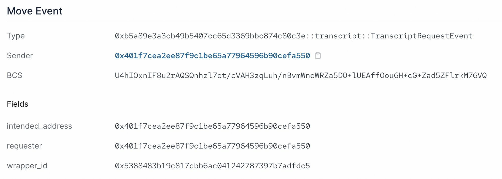
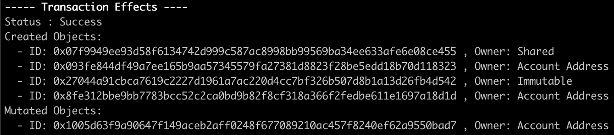
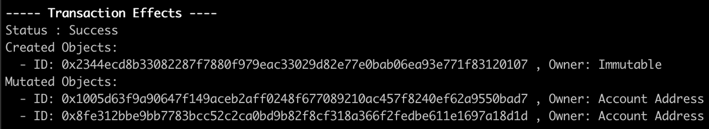

## 1. Events

Events 对 Sui Move 智能合约很重要，是索引器 indexers 追踪链上行为时的主要方法。对比服务器后端，你可以将 events 理解为服务器日志 logging, 而 indexers 则是解析器 parsers.

Sui 上面的 events 也是以 objects 的形式表示。在 Sui 中有几种系统层级的 events, 包括 Move event, Publish event, Transfer object event 等。要看系统层级 event 类型的完整清单，可以参考这份 [Sui Events API 页面](https://docs.sui.io/build/event_api)。

## 定制化 Events

开发者也可以在 Sui 上根据需要自己定义 events. 可以像下面那样定制一个 event 来标记一次请求成绩记录单的事件。

```rust
/// Event marking when a transcript has been requested
struct TranscriptRequestEvent has copy, drop {
    // The Object ID of the transcript wrapper
    wrapper_id: ID,
    // The requester of the transcript
    requester: address,
    // The intended address of the transcript
    intended_address: address,
}
```

表示 event 的类型具有 `copy` 和 `drop` 的能力。Event objects 不代表资产，我们只对其包含的数据感兴趣。所以，它们可以被复制，在作用域结束后被销毁。

要在 Sui 上发出一个 event 信号，你只需要使用`[sui::event::emit` 函数方法](https://github.com/MystenLabs/sui/blob/main/crates/sui-framework/docs/event.md#function-emit)。

调整一下我们的 `request_transcript` 函数方法去发出这一 event 信号:

```rust
public entry fun request_transcript(transcript: WrappableTranscript, intended_address: address, ctx: &mut TxContext){
    let folderObject = Folder {
        id: object::new(ctx),
        transcript,
        intended_address
    };
    event::emit(TranscriptRequestEvent {
        wrapper_id: object::uid_to_inner(&folderObject.id),
        requester: tx_context::sender(ctx),
        intended_address,
    });
    //We transfer the wrapped transcript object directly to the intended address
    transfer::transfer(folderObject, intended_address);
}
```

在 Sui explorer 中，我们可以看到发出 event 的信息会像下面那样陈列。我们在 `TranscriptRequestEvent` event 中定义的三条数据属性都被展示了出来:



**这里能找到这个成绩记录单示例项目的完整代码: [transcript.move](https://github.com/RandyPen/sui-move-intro-course-zh/blob/main/unit-two/example_projects/transcript/sources/transcript.move)**

尝试使用 Sui CLI 客户端去创建，请求和解包成绩记录单，然后在cli命令行里会看到Events的信息回执。

## Events 相关资料

[Events - Sui Move by Example](https://examples.sui.io/basics/events.html)

[Sui Events API](https://docs.sui.io/build/event_api)

# 2. 合约升级

## 合约升级的本质

在之前课程的实践中，你会发现发布的合约 package 是不可变的 object, 不可撤回也无法修改。智能合约升级的本质是在新的地址上重新发布更新的合约，并且把旧版合约的数据迁移过去。

## 可以升级的内容

升级合约时做的代码修改需要满足以下条件：

- 现有的 public 函数的输入输出参数格式保持不变
- 可以添加新的 structs 和 函数
- 可以给现有的 structs 添加新的能力
- 可以把现有函数中对范型参数的约束去掉
- 可以改变函数的实现
- 可以修改非 public 函数的输入输出参数格式，包括 friend 和 entry 函数

## 注意

### init 函数

init 函数只会在第一次发布合约时执行，后面升级合约时不会再次执行。

### 升级合约不会自动更新依赖

假定你的 package 有依赖一个外部的 package, 当所依赖 package 升级合约时，你的 package 不会自动把依赖关系调整为所依赖 package 升级后的合约地址，您必须明确地升级自己的 package, 以指向新的依赖项。

# 数据迁移

智能合约升级还涉及到数据迁移，将旧版合约中的数据移动到新版合约中来。如果没有数据迁移，另外重新发布一个合约也行。

## 共享的 Object

记录的数据通常会以共享的 object 存放，合约升级之后，新版和旧版的合约其实都还可以对该共享的 object 进行操作。

有的时候会因为函数不兼容或给共享 object 添加了动态属性导致不兼容造成出错。可以考虑给共享 object 添加版本属性，限制只允许新版的合约进行操作，打破共享 object 的往后兼容，强迫用户选择升级。

## 计数器合约升级

以一个计数器的案例来演示如何进行合约升级。

### 实现目标

原始合约是使用了共享 object 来累加计数

```rust
public entry fun increment(c: &mut Counter) {
    c.value = c.value + 1;
}
```

升级后的合约添加了每累加 100 就发出 event 信息的功能

```rust
struct Progress has copy, drop {
    reached: u64
}

public entry fun increment(c: &mut Counter) {
    c.value = c.value + 1;

    if (c.value % 100 == 0) {
        event::emit(Progress { reached: c.value });
    }
}
```

只实现了原本计数功能的合约可以在这里找到[完整代码](https://github.com/RandyPen/sui-move-intro-course-zh/blob/main/advanced-topics/upgrade_packages/example_projects/counter/sources/counter_1.move_wip)。

### 修改合约以支持升级

对原本计数功能的合约进行修改，以支持后续合约升级中的数据迁移。

1. 在合约当前 module 中使用常量 `VERSION` 记录当前的版本信息.

```rust
const VERSION: u64 = 1;
```

1. 在共享 object `Counter` 中添加新的 `version` 属性来记录当前共享 object 的版本信息。

```rust
struct Counter has key {
    id: UID,
    // 2. Track the current version of the shared object
    version: u64,
    // 3. Associate the `Counter` with its `AdminCap`
    admin: ID,
    value: u64,
}
```

1. 让执行共享 object 版本升级数据迁移的操作成为专有操作，并只允许使用 `AdminCap` 来调用。

```rust
/// Not the right admin for this counter
const ENotAdmin: u64 = 0;

fun init(ctx: &mut TxContext) {
    let admin = AdminCap {
        id: object::new(ctx),
    };

    transfer::share_object(Counter {
        id: object::new(ctx),
        version: VERSION,
        admin: object::id(&admin),
        value: 0,
    });

    transfer::transfer(admin, tx_context::sender(ctx));
}
```

1. 确保所有调用了共享 object 的 entry 函数都会检查，确保共享 object 的版本属性 `version` 与合约版本 `VERSION` 一致。

```rust
/// Calling functions from the wrong package version
const EWrongVersion: u64 = 1;

public entry fun increment(c: &mut Counter) {
    // 4. Guard the entry of all functions that access the shared object with a version check.
    assert!(c.version == VERSION, EWrongVersion);
    c.value = c.value + 1;
}
```

修改到可以支持升级的合约可以在这里找到[完整代码](https://github.com/RandyPen/sui-move-intro-course-zh/blob/main/advanced-topics/upgrade_packages/example_projects/counter/sources/counter_2.move_wip)。

这时候 package 配置文件 `Move.toml` 的格式是这样的

```rust
[package]
name = "sui_package"
version = "0.0.0"

[addresses]
sui_package = "0x0"
```

使用 Sui CLI 发布合约

```bash
sui client publish --gas-budget <GAS-BUDGET-AMOUNT>
```

并且记录下发布后的地址信息



`Immutable` 是合约发布地址，`Shared` 是该合约中共享的 object. 使用 [sui explorer](https://suiexplorer.com/) 或者

```bash
sui client object <OBJECT-ID>
```

判别区分出`AdminCap`和`UpgradeCap`. 其中`AdminCap`在后续共享object数据迁移中用来管理权限，`UpgradeCap`是合约升级的关键权限，在[下一节定制升级权限](https://github.com/RandyPen/sui-move-intro-course-zh/blob/main/advanced-topics/upgrade_packages/lessons/3_定制升级权限.md)做更详细讲解。

### 升级后的合约

升级后的合约除了功能更新之外，还需要做以下额外修改。

1. 增大 package 的`VERSION`.

```rust
// 1. Bump the `VERSION` of the package.
const VERSION: u64 = 2;
```

1. 引入 `migrate` 函数来升级共享 object.

```rust
// 2. Introduce a migrate function
entry fun migrate(c: &mut Counter, a: &AdminCap) {
    assert!(c.admin == object::id(a), ENotAdmin);
    assert!(c.version < VERSION, ENotUpgrade);
    c.version = VERSION;
}
```

需要注意的是，`migrate` 函数是非public的entry函数，这允许了将来升级的合约可以自由修改输入的参数格式。还做了 `AdminCap` 权限管理的检查以及确保合约先升级再进行共享object升级的检查。

在合约升级之后，共享的 object 并不会自动升级，还需要调用 `migrate` 函数升级。

其他功能更新

```rust
struct Progress has copy, drop {
    reached: u64,
}

/// Not the right admin for this counter
const ENotAdmin: u64 = 0;

/// Migration is not an upgrade
const ENotUpgrade: u64 = 1;

/// Calling functions from the wrong package version
const EWrongVersion: u64 = 2;

public entry fun increment(c: &mut Counter) {
    assert!(c.version == VERSION, EWrongVersion);
    c.value = c.value + 1;

    if (c.value % 100 == 0) {
        event::emit(Progress { reached: c.value })
    }
}
```

升级后的合约可以在这里找到[完整代码](https://github.com/RandyPen/sui-move-intro-course-zh/blob/main/advanced-topics/upgrade_packages/example_projects/counter/sources/counter.move)。

对配置文件 `Move.toml` 进行编辑，`<ORIGINAL-PACKAGE-ID>` 填写之前发布合约的地址。

```rust
[package]
name = "sui_package"
version = "0.0.1"
published-at = "<ORIGINAL-PACKAGE-ID>"

[addresses]
sui_package = "0x0"
```

运行合约升级命令行，其中`<UPGRADE-CAP-ID>`处填写`UpgradeCap`的Object ID.

```bash
sui client upgrade --gas-budget <GAS-BUDGET-AMOUNT> --upgrade-capability <UPGRADE-CAP-ID>
```

运行结果如下，表明合约升级成功，其中出现的 `Immutable` 是升级后合约的发布地址。



# 定制升级权限

## 升级权限类型

在先前的示范中，智能合约升级几乎可以把所有功能重写，这会让用户产生担心。

当然，Sui Move也提供了不同等级的合约升级权限。从宽松到收紧的程度罗列如下：

- Compatible: 最宽松的权限。可以修改所有函数的实现。可以剔除函数对范型输入参数的能力约束。可以让非`public`的函数变为`public`. 可以修改、删除任意 `private`, `public(friend)` 和 `entry` 函数的输入输出参数。但除了能力约束之外不能修改`public`函数的输入输出参数。不能修改已有的类型。
- Additive: 可以给 package 添加新的函数，比如新的 `public`函数和`struct`. 但不能对现有函数的代码做任何修改。
- Dependency-only: 只能修改该 package 的依赖项。
- Immutable: 无法再升级该 package .

最初发布合约的时候，得到的合约升级权限是最宽松的 Compatible. 可以调用 [package.move](https://github.com/MystenLabs/sui/blob/main/crates/sui-framework/packages/sui-framework/sources/package.move) 模块中的 `only_additive_upgrades`, `only_dep_upgrades` 和 `make_immutable` 这三个 public entry 函数来单向收紧升级权限。

## 合约升级过程


合约升级的过程可以理解为三个环节。

1. Authorization: 使用`UpgradeCap`授权升级合约，生成一个`UpgradeTicket`.
2. Execution: 虚拟机消费了这个`UpgradeTicket`并验证合约的字节码、与旧版合约的兼容性，在链上创建升级后合约object. 如果升级成功就会返回`UpgradeReceipt`.
3. Commit: 根据返回的`UpgradeReceipt`更新`UpgradeCap`上关于新建的 package 信息。

其中第2步 Execution 是内部指令，第1步和第3步在 [package.move](https://github.com/MystenLabs/sui/blob/main/crates/sui-framework/packages/sui-framework/sources/package.move) 中使用函数实现。

```rust
module sui::package {
    public fun authorize_upgrade(
        cap: &mut UpgradeCap,
        policy: u8,
        digest: vector<u8>
    ): UpgradeTicket;

    public fun commit_upgrade(
        cap: &mut UpgradeCap,
        receipt: UpgradeReceipt,
    );
}
```

## 定制权限作用

除了通过内置的命令行 `sui client upgrade` 调用默认的 authorization 和 commit 环节，还可以定制升级权限添加更多条件约束，比如投票、治理、允许清单、时间锁等功能。

## 可升级合约的相关资料

[sui-move-intro-course-zh/1_合约升级.md at main · RandyPen/sui-move-intro-course-zh](https://github.com/RandyPen/sui-move-intro-course-zh/blob/main/advanced-topics/upgrade_packages/lessons/1_合约升级.md)

[Package Upgrades](https://docs.sui.io/build/package-upgrades)

## 可升级合约视频资料

https://youtu.be/1Kr_C0l07eo